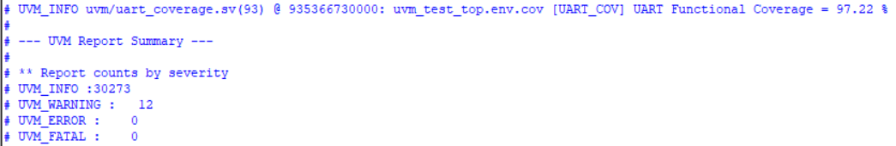

# UART UVM Verification Environment

This project implements a UVM-based verification environment for a UART design, validating data transmission, parity handling, stop-bit behavior, and error scenarios using directed and constrained-random testing.

## Features

-UVM-based agent with driver, monitor, and sequencer
-Predictor-based scoreboard for expected vs actual comparison
-Functional coverage collection for protocol scenarios
-SystemVerilog protocol assertions (parity and stop-bit checks)
-Directed and constrained-random test sequences
-Error injection (parity mismatch and frame errors)
-TLM communication using uvm_analysis_port and uvm_tlm_analysis_fifo

## Testbench Architecture

RTL
- uart_tx
- uart_rx
- uart_baud_gen
- uart_channel

Verification
- Agent
- Driver
- Monitor
- Predictor
- Scoreboard
- Coverage
- Assertions

## Tests

- uart_base_test
- uart_parity_error_test
- uart_stress_test

## Environment Components

The verification environment includes:

- UART Agent
  - Driver
  - Monitor
  - Sequencer
- Scoreboard
- Predictor
- Functional Coverage
- Assertions

## Tests Implemented

- Base test
- Stress test
- Parity error test
- Random sequence traffic
  
## Simulation

Run the simulation in QuestaSim using:

do run.do

## Coverage

Functional coverage achieved: **97.22%**

## Author

Datta Sasank
